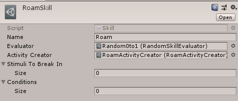

# AI

If you need to use your own AI you just need to implement `IAIActionResolver` and bind your class to this type in `GameGlobalsInstaller` (more about dependency injection [here](https://github.com/azsdaja/Osnowa/blob/master/Docs/DI.md)).

Osnowa uses utility-based AI configured via assets (ScriptableObjects). You can find them in Assets/GameAssets/AI folder.

# Activities, Skills, Conditions and utility evaluation
Activity is an object representing a task that an actor is occupied with at the moment. Each time a turn is given to an actor, it uses his current activity to generate a `GameAction` that the actor will perform.

Each actor has a component with a list of **Skills** defining what he can do. Each skill has a **SkillEvaluator**, a list of **Conditions** and an **ActivityCreator**.  

* `SkillEvaluator` returns the utility score (0.0-1.0 number) of given skill basing on context. 
* When an actor needs to decide what action it should take (in `AiActionResolver`), it orders `UtilityAi` to go through all of the skills it has, choose the ones which conditions are satisfied, run their evaluators and choose the skill that had the highest score. * Then, the ActivityCreator is used to create an activity that will be assigned to the actor.

For example skills like **Roam** should have low utility score and skills like **RunAwayFromEnemy** should have high score but they also should have **Conditions** which would make sure that the entity is in danger.

Some skills also define **Stimuli** which are kind of event triggers — but this mechanic is a work in progress currently.