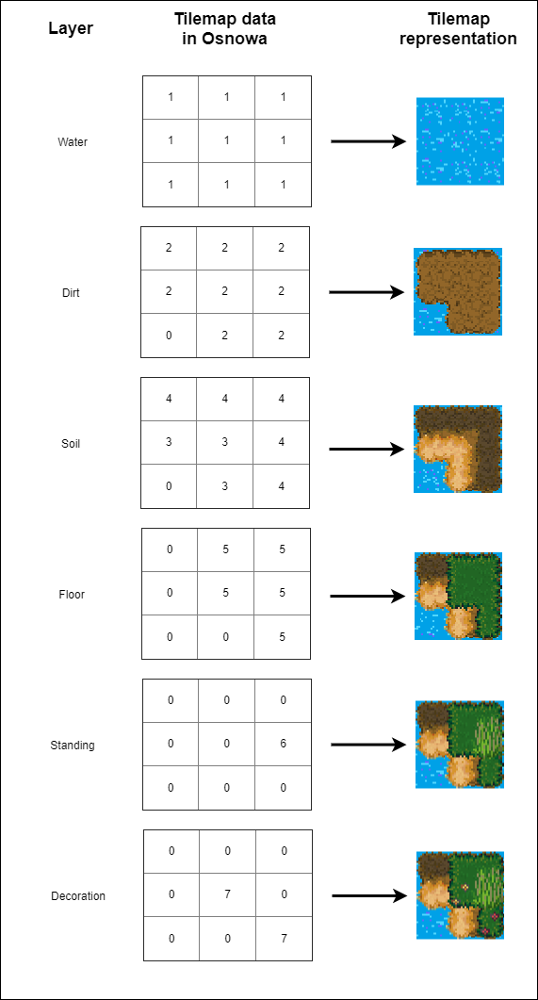
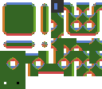
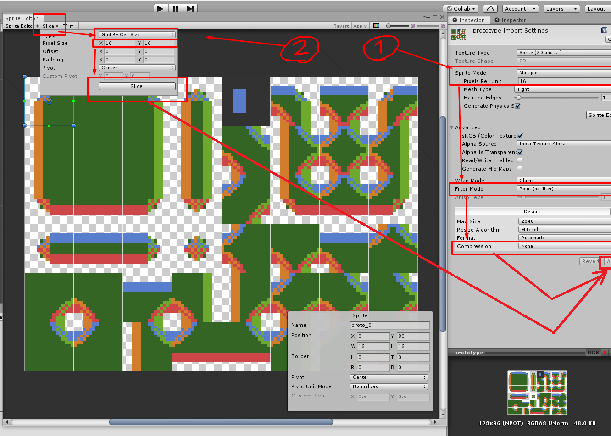
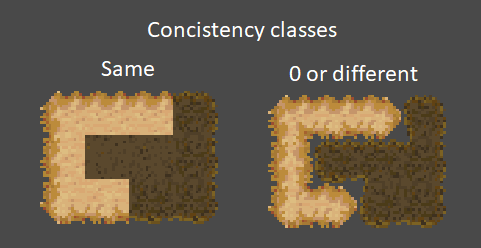
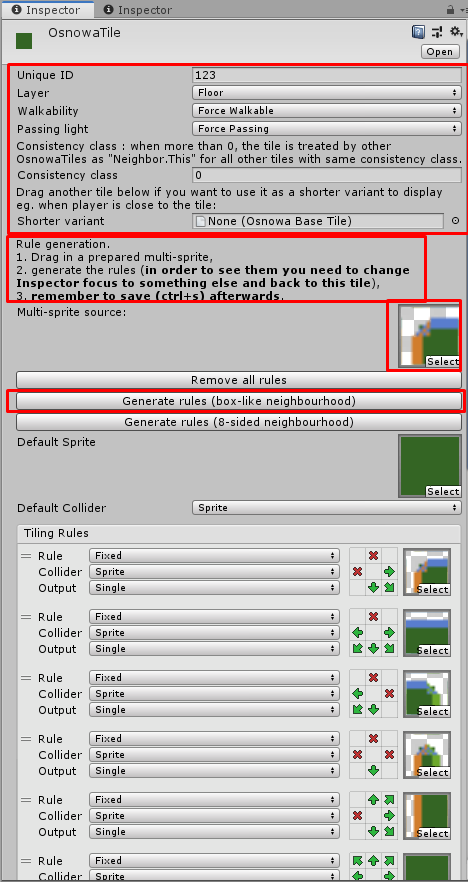

# Tiles

The tilemap is stored on Osnowa side in two-dimensional arrays, one per each layer:
``` csharp
public interface IOsnowaContext
{
    ...
    MatrixByte[] TileMatricesByLayer { get; }
    ...
}
```

Tiles are identified by unique IDs. They are stores as `byte` values, so if you want to use more than 256 different tiles, you have to change the matrix type.

```
context.TileMatricesByLayer[TilemapLayers.Standing].Set(3, 4, treeTile.Id);
```

Tiles are organised into layers. Each layer is dedicated for different types of tiles, for example water (seas, lakes, rivers), soil (swamp, sand or well, soil), floor tiles (grass, roads, floors), standing tiles (trees, bushes, barrels, furniture), decoration tiles (fog, flowers etc.). A layer can have exactly one tile at given position.
In Osnowa.Unity, each layer corresponds to one Unity Tilemap object in the scene. 



# Updating tiles in runtime

When tile data is updated in `TileMatricesByLayer[]`, two things should follow afterwards:
1. `PositionFlags` should be also changed, so that the walkability and light passability at given position are updated.
2. The actual tilemap in presentation layer (eg. Unity tilemap) should be updated, so that the changes are visible.

That's why you should rather not access `TileMatricesByLayer` directly but use `ITileMatrixUpdater`, which is ment to take care of all of these updates:
```tileMatrixUpdater.Set(position, tileToSet);```

# Creating tiles

Osnowa's template game is using tiles with base size 16x16, but it shouldn't be difficult to switch to something else.
In order to use your own tiles to use with Unity, you have to create a proper multi-sprite and apply it to OsnowaTile asset. If you're familiar with [Unity 2D extras project](https://github.com/Unity-Technologies/2d-extras), `OsnowaTile` class is based upon `RuleTile`.
* Prepare an image for the tile. If you want to have Osnowa auto-generate neighbourhood rules, it has to follow one of the two following patterns:

Box-like tiles:


Tiles with any combination of tiles at 8 neighbouring positions:



Like in the examples above, you can include as many additional variants of central sprite (the one that doesn't have edges) after all the other variants.
* Make your image a multi-sprite like in the screenshot (remember about no point filtering and no compression if you want to keep the pixels undiffused):

* Click Assets —> Create —> Osnowa —> OsnowaTile. Now you have an OsnowaTile asset. Place it in proper folder (eg. Assets/Tiles).
* Look at the Inspector window with your OsnowaTile asset selected. Properties are:
	* ID — number (of `byte` type) that will be used to identify the tile on tile matrix
	* Layer — on which layer the tile will be placed
	* Walkability options:
		  * Indifferent — doesn't change walkability of a position resolved on lower layers.
		  * ForceWalkable — forces the position to be walkable, no matter what was on lower layers. Still can be changed by walkability of upper layers.
		  * ForceUnwalkable — forces the position to be unwalkable, no matter what was on lower layers. Still can be changed by walkability of upper layers.
	* Passing light options: analogically.
    * Consistency class: allows different tiles to be treated as same tile for neighbour-checking purposes:
    
    
    
	* Shorter variant: an optional tile that will replace this tile when there is need for clearer view, for example when the player character is close.
	* Tiling rules: define which variant of the tile will be shown based on its neighbourhood and/or random factors
* If you're using auto-generation, drag your multi-sprite to Multi-sprite source property and click one of the buttons for generating rules. Switch focus to other asset and back to see the results.

* Without auto-generation, you have to define the rules on your own. Take a look at other tiles to get the hang of how the rules work.
